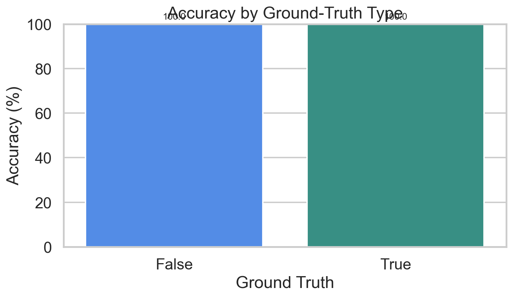
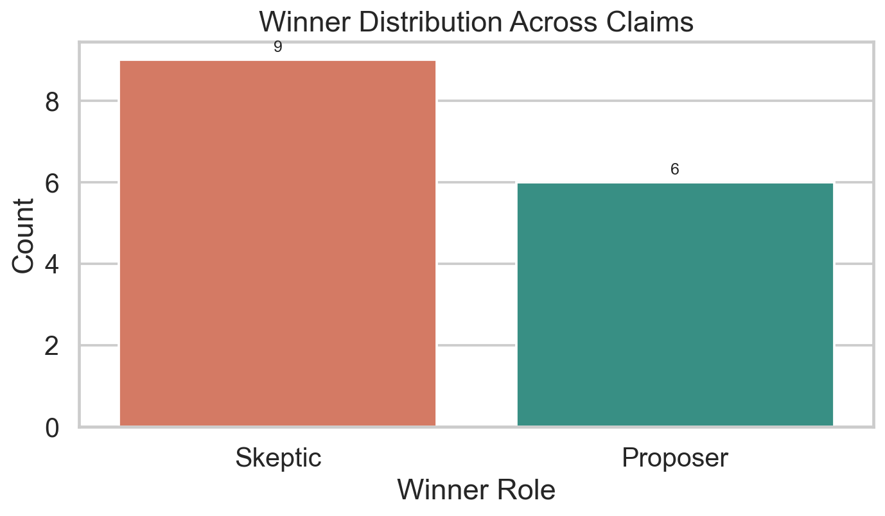
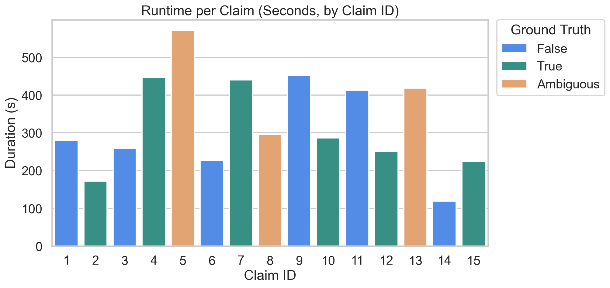
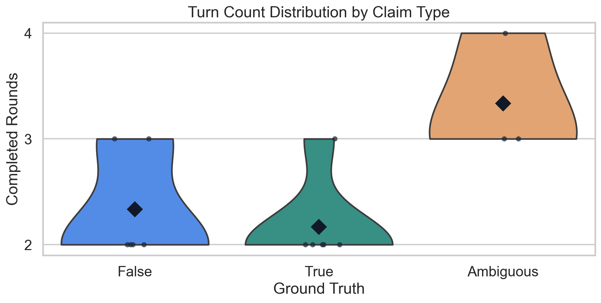
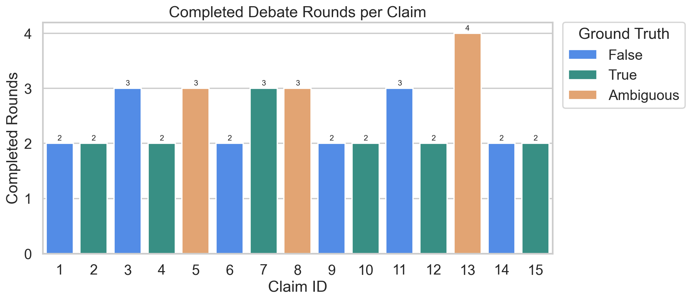
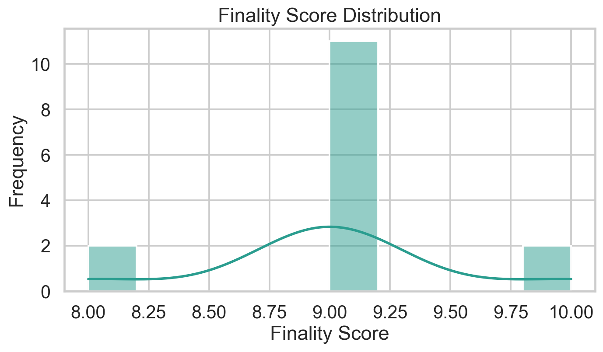
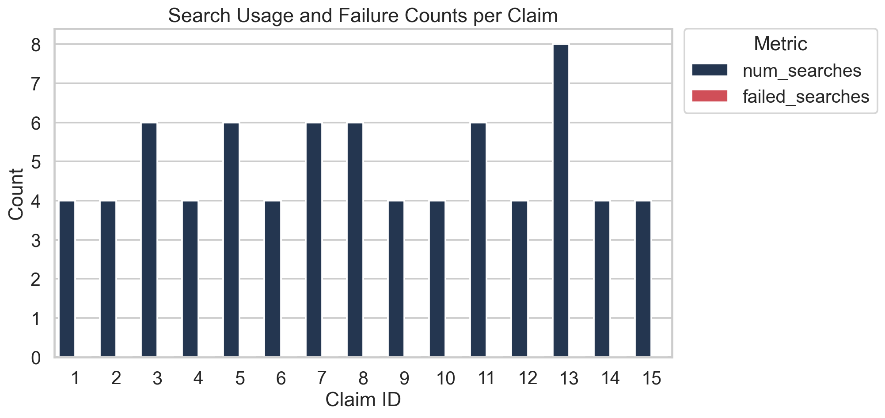
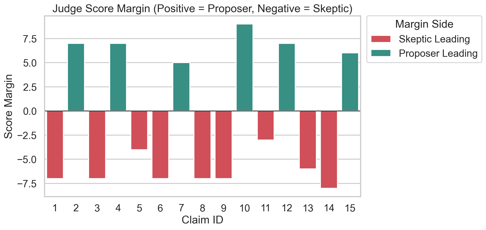
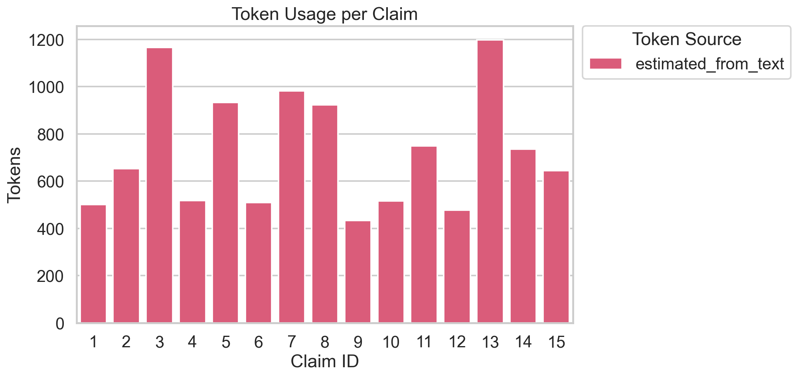

# Multi-Agent Fact-Check Debate: Evaluation Report

Total Claims Run: 15
Evaluatable Claims (True/False only): 12

## Metric 1: Verdict Quality
Measures whether the winner matches expected winner by claim truth label.

| KPI | Value |
|---|---:|
| Overall accuracy | 100.0% (12/12) |
| Correct verdicts | 12 |
| Incorrect verdicts | 0 |

No incorrect verdicts in evaluatable claims.

## Metric 2: Debate Efficiency
Measures how quickly and decisively the debate converges.

| KPI | Value |
|---|---:|
| Average turns | 2.47 |
| Average runtime (seconds) | 323.80 |
| Average finality score | 9.00 |

## Metric 3: Retrieval Effectiveness
Tracks how often search is used and how often it fails to return context.

| KPI | Value |
|---|---:|
| Average searches per claim | 4.93 |
| Total failed searches | 0 |

## Metric 4: Judge Reliability
Evaluates parsing stability and score separation behavior.

| KPI | Value |
|---|---:|
| Parse success rate | 100.0% |

## Metric 5: Token and Cost Profile
Reports token usage and source reliability.

| KPI | Value |
|---|---:|
| Average total tokens per claim | 729.13 |
| Claims with provider token metadata | 0.0% |
| Token source counts | {'estimated_from_text': 15} |

## Full Claim Log
| ID | Topic | Ground Truth | Expected | Winner | Verdict | Rounds | Finality | Searches | Failed Searches | Tokens | Token Source | Parse | Duration (s) |
|---:|---|---|---|---|---|---:|---:|---:|---:|---:|---|---|---:|
| 1 | Astronomy/Myth | False | Skeptic | Skeptic | Pass | 2 | 9 | 4 | 0 | 501 | estimated_from_text | Yes | 279.67 |
| 2 | History/Space | True | Proposer | Proposer | Pass | 2 | 9 | 4 | 0 | 653 | estimated_from_text | Yes | 172.16 |
| 3 | Health | False | Skeptic | Skeptic | Pass | 3 | 9 | 6 | 0 | 1165 | estimated_from_text | Yes | 258.87 |
| 4 | Mathematics | True | Proposer | Proposer | Pass | 2 | 9 | 4 | 0 | 518 | estimated_from_text | Yes | 446.90 |
| 5 | AI/Society | Ambiguous | Either | Skeptic | N/A | 3 | 8 | 6 | 0 | 932 | estimated_from_text | Yes | 571.35 |
| 6 | Neuroscience/Myth | False | Skeptic | Skeptic | Pass | 2 | 9 | 4 | 0 | 509 | estimated_from_text | Yes | 227.31 |
| 7 | Chemistry | True | Proposer | Proposer | Pass | 3 | 9 | 6 | 0 | 982 | estimated_from_text | Yes | 440.71 |
| 8 | Health/Nutrition | Ambiguous | Either | Skeptic | N/A | 3 | 9 | 6 | 0 | 922 | estimated_from_text | Yes | 295.45 |
| 9 | History | False | Skeptic | Skeptic | Pass | 2 | 9 | 4 | 0 | 434 | estimated_from_text | Yes | 452.38 |
| 10 | Geography | True | Proposer | Proposer | Pass | 2 | 10 | 4 | 0 | 516 | estimated_from_text | Yes | 286.17 |
| 11 | Biology/Myth | False | Skeptic | Skeptic | Pass | 3 | 8 | 6 | 0 | 749 | estimated_from_text | Yes | 413.11 |
| 12 | Physics | True | Proposer | Proposer | Pass | 2 | 9 | 4 | 0 | 478 | estimated_from_text | Yes | 250.48 |
| 13 | Nutrition | Ambiguous | Either | Skeptic | N/A | 4 | 9 | 8 | 0 | 1197 | estimated_from_text | Yes | 418.98 |
| 14 | History/Myth | False | Skeptic | Skeptic | Pass | 2 | 10 | 4 | 0 | 736 | estimated_from_text | Yes | 119.38 |
| 15 | Geography | True | Proposer | Proposer | Pass | 2 | 9 | 4 | 0 | 645 | estimated_from_text | Yes | 224.11 |